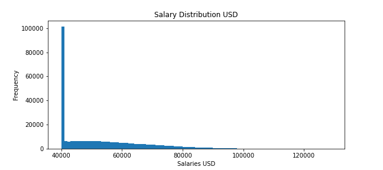
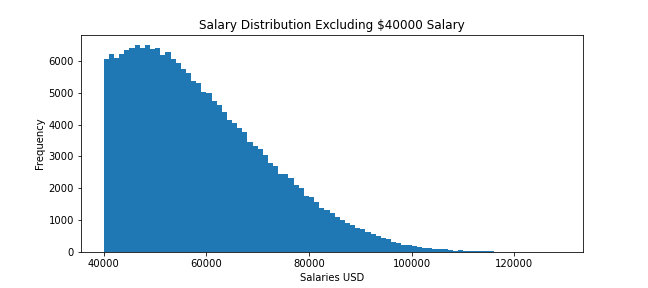

# Data Analytics
## SQL Sample
### I used mock table data from an old employee database, and I was able to work to some conclusions about the fidelity of the data.  I formed a data model using an ERD tool and used that model to build and import the data into a PostgreSQL database schema, enforcing normalization through keys and relationships.  With the database intact, I performed needed queries of the data.  I then used Jupyter Notebook with Pandas, SQLAlchemy, and Psycopg to further analyze the data. I was able to visually show anomalies with the salary data using histograms and bar graphs of the salary data. 

#### Work Files
- Notebook
  - [Jupyter Notebook](/EmployeeSQL/queries/DA1_Employee_Info.sql)
- Queries
  - [DA1_Employee_Info](/SQL/EmployeeSQL/queries/DA1_Employee_Info.sql)
  - [DA2_Employee_Hire_Date](/SQL/EmployeeSQL/queries/DA2_Employee_Hire_Date.sql)
  - [DA3_Department_Managers](/SQL/EmployeeSQL/queries/DA3_Department_Managers.sql)
  - [DA4_Employee_Department_Info](/SQL/EmployeeSQL/queries/DA4_Employee_Department_Info.sql)
  - [DA5_Employee_Hercules](/SQL/EmployeeSQL/queries/DA5_Employee_Hercules.sql)
  - [DA6_Employee_Sales_Dept](/SQL/EmployeeSQL/queries/DA6_Employee_Sales_Dept.sql)
  - [DA7_Employee_Sales_and_Dev_Dept](/SQL/EmployeeSQL/queries/DA7_Employee_Sales_and_Dev_Dept.sql)
  - [DA8_Employee_Last_Name_Freq](/SQL/EmployeeSQL/queries/DA8_Employee_Last_Name_Freq.sql)
## Excel Sample
### I used mock data in Excel about crowd funding, and I was able to work to some conclusions about crowd funding campaigns. I leveraged conditional formatting, formula calculations, pivot charts, and pivot tables. I calculated means, variances, and standard deviations, in the data analysis and was able to come to some conclusions.

#### Given the provided data, what are three conclusions that we can draw about crowdfunding campaigns?
 - Most crowdfunding campaigns are successful.
 - Crowdfunding campaigns seeking goals between $15,000 and $35,000 have been funded more than 75% of the time.
 - Crowdfunding campaigns for theater, music, film & video, account for more than 70% of all failed outcomes.
#### What are some limitations of this dataset?
 - More than 1/3 of crowdfunding campaigns have been for the plays subcategory which could skew summaries about the viability of campaigns for other categories and subcategories.
 - The dataset does not have enough entries to statistically account for how the 10 or more columns of varying data relate to outcomes.
#### What are some other possible tables and/or graphs that we could create, and what additional value would they provide?
 - Graphing country vs. outcome could provide valuable insight into the viability of crowdfunding campaigns originating in different countries.
 - Graphing currency vs. outcome could provide valuable insight into the viability of crowdfunding campaigns based on the chosen base currency solicited.
#### Work Files
- [CrowdfundingBook.xlsx](Excel/work_files/CrowdfundingBook.xlsx)
- [Excel_Challenge.docx](Excel/work_files/Excel_Challenge.docx)
